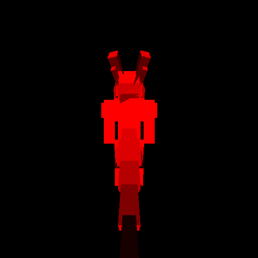
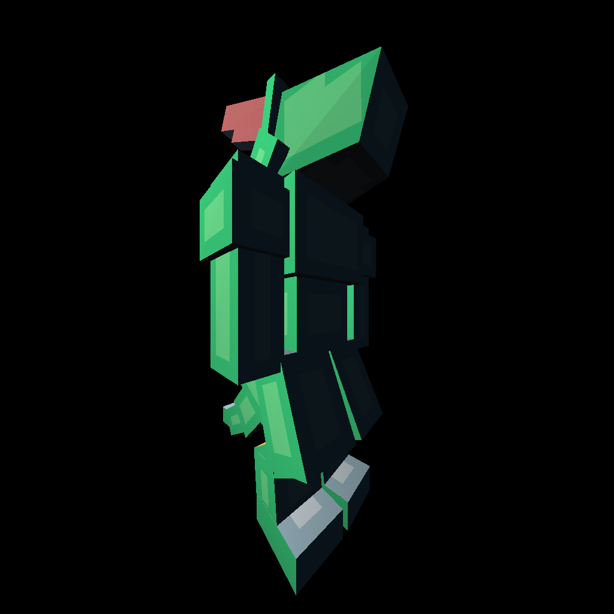
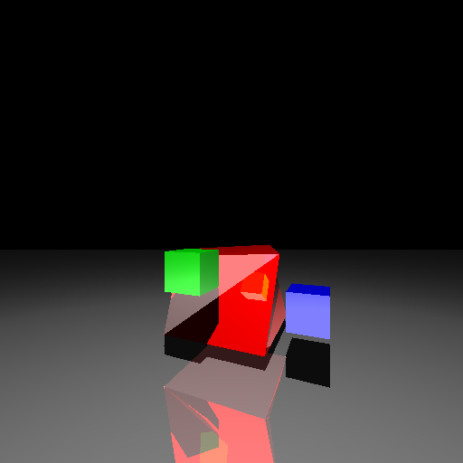
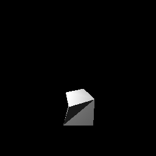

# VSC
  
"I might have to wait, I'll never give up. I guess it's half timing, and the other half is luck..." -Michael Buble  
  
VSC (VOUGA-SHREINER-CANTH) Verified is A real-time 3D rendering engine written entirely using software with the intention of being portable.
Inspired by DoomGeneric with its rather novel approach to separating the backend from the frontend.  
Also self-inspired by my (NormalExisting's) other C++ backends mostly for games/clones such as The Witness and Chess.  
  
This is a rasterizer. It uses computational techniques to approximate the reality of lights, shadows, textures, and materials.  
If you want a raytracer stay tuned for the sequel FINAL DESTINATION coming soon to theaters near you in the `raytracer` directory.  
  
# CREDITS  
  
Everything in here is based on the book Mathematics for 3D Game Programming and Computer Graphics (Third Edition) by Eric Lengyel, as well as various other resources including CS354H (UT Austin Computer Graphics Honors) and other online resources on graphics. 

Mathematics for 3d Game Programming will be dubbed as the "Skeleton Book" because of its cover. All files were written primarily by NormalExisting using the Skeleton Book (et al.) as basis and inspiration.
  
# DEDICATIONS  
  
Etienne Vouga (Graphics Professor at UT Austin, some of his teachings influences this work)  
Dave Shreiner (Author of the Official OpenGL Guide)  
Coela Canth (Creator of another rendering engine actually a raytracer)  

VSC Verified is a community-made level created and completed ("verified") by player nSwish in the game Geometry Dash, intended to be a joke but also happens to be extremely challenging. It uses the song "Haven't Met You Yet" by Michael Buble as the background music, and requires several perfectly timed inputs to various rhythms presented by the song.  

# HOW TO USE THIS

Look in the `test` folder for some example runner code. Or you can modify `main.cpp` as the runner. The Makefile provided is a template that builds and runs `main.cpp` and then the `render.py` which renders the contents of the output buffer (The buffer to render is to be specified in `render.py`).  
  
There is also code in `ESP32` that makes this compatible with your ESP32.  
  
Be aware that the API is constantly changing as this is in development. However the changes should not need to be too severe.

# HOW TO RECREATE THIS  
  
Follow the Skeleton book until the end of chapter 5. Some linear algebra background is recommended.  
After chapter 5 we make the actual renderer that has the basic rendering abilities of single-color triangles and meshes under a directional light.  
And then after that we go into the more juicy stuff such as texturing, clipping, visibility culling, and the like.  
  
There is a document named `NOTES.md` that holds notes that might be useful. It's like playing a game of Super Metroid.

# QUESTIONS/CONCERNS/ISSUES

Feel free to push an issue, do a pull request, or simply contact me (NormalExisting on Discord, Bluesky, and Telegram).

# SHOWCASE!

|     |     |
| ------------- | ------------- |
|   |   |
|   |   |

<!--  -->
<!--  -->
<!--  -->